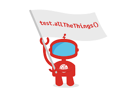

<!-- PROJECT LOGO -->
 

  

<h1 align="center">SwagLabs Project</h1>

  

     Mobile testing framework for the Sauce Demo application: Tests created that exercise the application's different functionalities!
     
     

  

## Application demo:
* Simple app- provides different login credentials.
* Successful login leads to inventory page.
* Different products can be added to the cart.
* Products in cart are sent to checkout.

<!-- ABOUT THE PROJECT -->
## About The Project
The functionalities of the project were tested to ensure that the Application is following the requirements.
Page Objective Models (poms) were created for each of the following pages:
* LoginPage
* ProductsPage
* CartPage
* CheckoutPages
    Tests were then run for each of these classes to ensure the app was working as expected.
  

## Project objectives

* Setting up collaboratively environment to work together using GitHub.
* Creating pom’s for different application screens.
* Create automated web tests using Appium framework , TestNG framework and SHAFT ENGINE template.
* Creating an automated test execution report.
* Externalizing test data from json file.

### Tools used
* Java
* Intellj IDEA
* Maven
* Appium
* TestNG
* Shaft Engine

(<a href="#readme-top">back to top</a>)

<!-- Methods available in Page Object Models: -->
# Methods available in Page Object Models:
## Login Page
* login(String userName, String password) ->used to login using userName and password then click login button
* validate_errorMessage(String expectedErrorMessage) -> assert on error message when entering invalid credentials

## Products Page
* getPageTitle() -> return the page title to assert that we are landed on products page.
* addItemToTheCart() -> used to add items to the cart.
* navigateTOCart() -> go to cart page.
* getItemTitle() -> return product title to assert on it.
* getItemPrice() -> return product price to assert on it.
* validateAddingTheItemToCart() -> to validate that the items id added to cart.

## Cart Page
* removeItemFromTheCart() -> used To remove item from the cart -_- .
* clickCheckOutButton() -> navigating to CheckOut page.

## CheckOut Pages
* enterCheckOutInfo(String firstName, String lastName , String postalCode) -> enter the info then click on continue button.
* validateTotalCostIsTaxPlusTotal() -> used to validate if the total price equal the itemPrice plus the Tax.
* validateSuccessMessage(String expectedMessage) -> used -+to assert on success purchase message

# Allure Reports
* <a href="http://192.168.1.3:62055/index.html#suites/d360a52769983e3d887954393d858973/48e5f8d8fe304c99/">Login Tests</a>
* <a href="http://192.168.1.3:62521/index.html#suites/c3c0c7874386c87c72a3ef77db6d10be/83950c8cf23e9487/"> products Tests </a>

